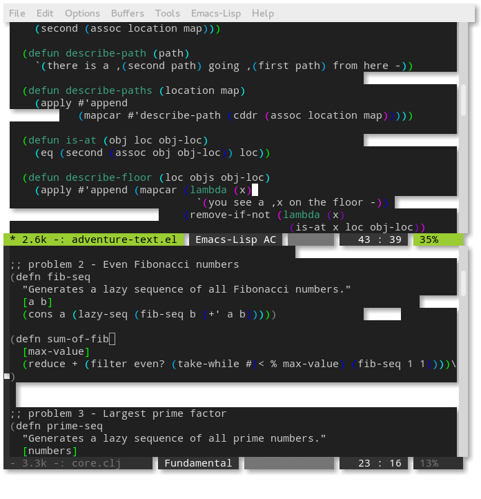

Custom emacs themes
===================
Faceless
--------
Largely inspired from [the ibdknox theme for Light Table](http://www.chris-granger.com/images/050/userbehaviors.png).

It's a fork of [jasonm23's bubbleberry](https://gist.github.com/jasonm23/3027622).

